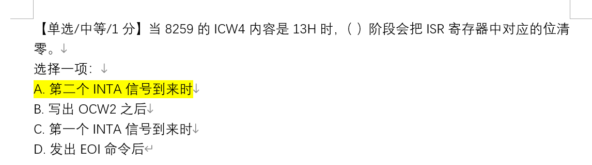
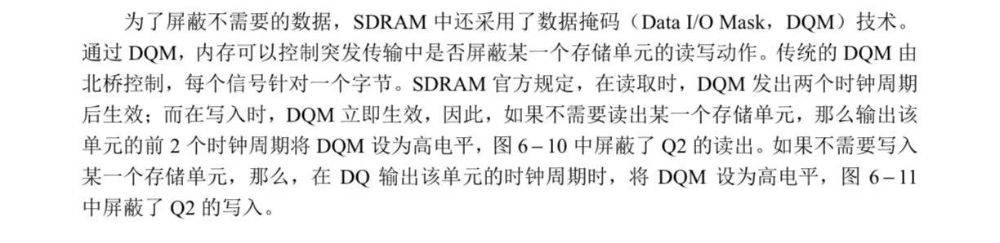

## 堆栈平衡

### 三种子程序调用方式

参数**从右至左**入栈，每一个函数（包括main），开始时需要
push ebp

mov ebp,esp

结尾时需要

pop ebp

#### cdecl

在main中，每一次call的下一条就是

**add esp，4*n**

n是参数个数，4代表参数为int四个字节，手动pop出堆栈中的参数

**cdecl 方式是通过[EBP+X]的方式来访问参数**  
[EBP+8]第一个参数  
[EBP+12]第二个参数  
...

[EBP+4]是call压入栈的返回地址

#### stdcall

不需要在main中手动add esp，需要在子程序返回时

**ret 4n**

n代表参数个数，4代表int四个字节（其他类似）

**然后在定义子程序的函数名之前加上__stdcall**

int __stdcall (int a,int b)

#### fastcall

传递第一个参数使用ecx,第二个用edx，其他与stdcall类似，在子程序名字前加 __fastcall

### 参数传递三种方法

- 通过寄存器传递
- 通过约定存储单元传递
- 通过堆栈传递

#### 函数定义

printf PROTO C :dword, :vararg

## 存储

### 内存芯片存储单元数量

行数 × 列数 × 单元格数据位数（位宽） × L-Bank的数量

### 带宽

内存的数据传输速度

带宽 = 位宽 × 总线频率 / 8 单位通常是 MB/s

### 内存颗粒

内存中的芯片  
SDRAM DDR DDR2 DDR3 DDR4

### 常见flash存储器

SSD、SD卡、U盘、SM卡  

### 非flash

HDD、DDR4 RAM

### CHS编址

柱面-磁头-扇区（C-H-S）

最大容量 = 磁道数 × 磁头数 × 扇区数 × 每个扇区的字节数

**一个扇区512个字节**

**只有扇区从1开始编号，注意减一**

### LBA编址

只对扇区编号 L

最大容量 = $2^L$

### CHS和LBA转换

L=( ( C × nH + H ) × nS ) + S - 1

H = ( L / nS ) % nH

C = ( L / nS ) / nH

S = L % nS + 1

## 总线

### 分类

按功能分为  

- 数据总线
- 地址总线
- 控制总线

### PCI总线

一种局部总线标准，逐渐被PCI-E替代

PCI-E用两根线的电压差来表示0和1，提高传输效率

### USB总线

通用串行总线

#### USB收发器

- 低速设备一侧，D-上拉
- 高速设备一侧，D+上拉

## 异步串行通信

一个信息帧只有一个字符

一个信息帧包括一个起始位0，一个终止位1，一个奇偶校验位，若干个数据位

**信息帧地址左低右高**

### 波特率

每秒传输的符号数

波特率 = 比特率 单位 b/s

### 调制和解调

- 调制：从数字信号到模拟信号
  - 调制方法：调幅、调频、调相
- 解调：从模拟信号到数字信号

控制器的**分频 = 输入频率 / 输出频率**

### 除数锁存器

f工作时钟 = f基准时钟 / 除数锁存器 = 波特率 × 16

**除数锁存器 = 115200 / 波特率**

除数锁存器结果表示分频

### WLAN组成

工作站、无限介质、无线接入点、主干式分布系统

## 中断

**外部的中断叫中断，内部的中断叫异常**

- 外部中断（异步）：可屏蔽和不可屏蔽
- 内部异常（同步）  
  CPU在执行指令期间检测到不正常的或非法的操作所引起的
  - 故障
  - 陷阱
  - 中止

>## 易错

**操作系统程序  特权级 0、1、2  
用户程序	 特权级 3**

**段选择符 16位  
段描述符 8字节**

**页表描述符、页描述符4字节**

**指令和伪指令的区别：**   
	每一条指令都要生成机器代码；伪指令只提供汇编程序信息，不生成目标码

**标准调用方式和C的调用方式 子程序的返回语句怎么去写**
- 标准调用方式子程序返回语句：RET N（N=参数个数*4）
- C的调用方式子程序返回语句：RET

**实模式和保护模式通过什么标志位去切换**  
通过修改控制寄存器CR0的控制位PE切换实模式（1）和保护模式（0）

**奇偶校验**  
- 奇校验：加上校验位有奇数个1
- 偶校验：加上校验位有偶数个1

代码保护：代码调用一致代码段

**接口哪些是差分的**  
**USB, SATA**

**怎么屏蔽中断？**

**页描述符、页表描述符中均有页面保护位**

所有位逻辑操作会把 CF 和 OF 清零

**8253芯片**

每个通道内部设有一个16位计数器，可进行二进制或十进制（BCD码）计数。  
采用二进制计数时， 写入的初值范围为0000H~0FFFFH，最大计数值是0000H，代表65536。  
采用BCD码计数时，写入的初值范围为0000~9999，最大计数值是0000，代表10000。

**k级级联的8259最多有几个中断源**  
8 * k - (k-1) = **7k + 1**

**实模式和保护模式下的中断向量种类数一样**

**保护模式下中断描述符表的长度为2KB**，因为一个描述符8个字节，共256种中断

ADD指令 看作有符号数时，只有 正+正=负，负+负=正 的时候才有 OF = 1

INVOKE 是伪指令，需要由汇编程序展开成几条指令

DIV 被除数位数是除数的两倍(EDX : EAX)，结果如果超出EAX范围，就会溢出

= 可以对同一符号重复定义  
EQU 不可以对同一符号重复定义

INT中断是内部中断，内部中断不可屏蔽  
外部中断可以屏蔽

**ADD在程序运行时执行，“+” 在编译过程中执行**

B

B

**注意字符串操作时，用byte ptr [edi/esi]来获取字符**
定义字符串时用单引号

div/mul 不能加立即数，需要寄存器或者内存单元

SRAM：读写速度快，生产成本高，多用于容量较小的高速缓冲存储器，不需要定时刷新

DRAM：读写速度较慢，集成度高，生产成本低，多用于容量较大的主存储器，存储的是电容，需要定时刷新

>## 问答题

### 1.解释什么是 32 位中内存的平坦模式，它与 16 位程序中的内存模式存在哪些区别？(主要从程序内存分配方面回答)

- 16位程序，由不同的段组合而成，且每个段的地址重定位有64K的限制。  
- 而平坦内存模式下，程序只有一个段，同时包含了代码和数据。程序无需进行地址重定位，内存访问范围达到4G宽度。在整个4G范围内，默认都是NEAR的。其优点是，汇编程序更容易编写，且代码执行速度更快。  
- 在32位程序中，所有的段寄存器依然存在，但是都被设置成了同一个值，这表明，段寄存器和地址重定位已经无须使用了。

### 2.简述机器语言，汇编语言，高级语言的区别

- 机器语言：计算机能直接识别的语言，用二进制代码的机器语言表示，每条机器代码由CPU执行
- 汇编语言：介于机器语言和高级语言之间，使用指令、助记符、符号地址等符号来编写程序，指令语句和机器代码一一对应
- 高级语言：一种类似于自然语言和数学语言的语言

### 3.汇编语言的难移植性

- 汇编语言是直接操作硬件的，不同CPU的硬件结构不同，每种CPU都有自己的机器语言，所以汇编语言不能移植。
